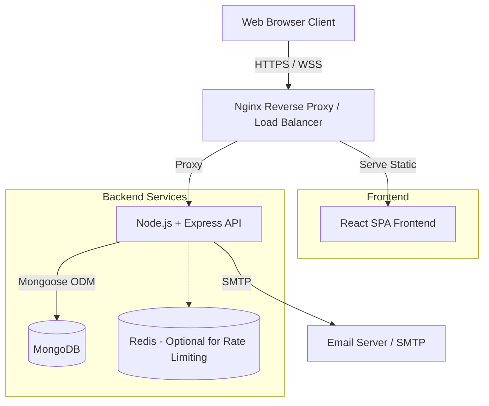
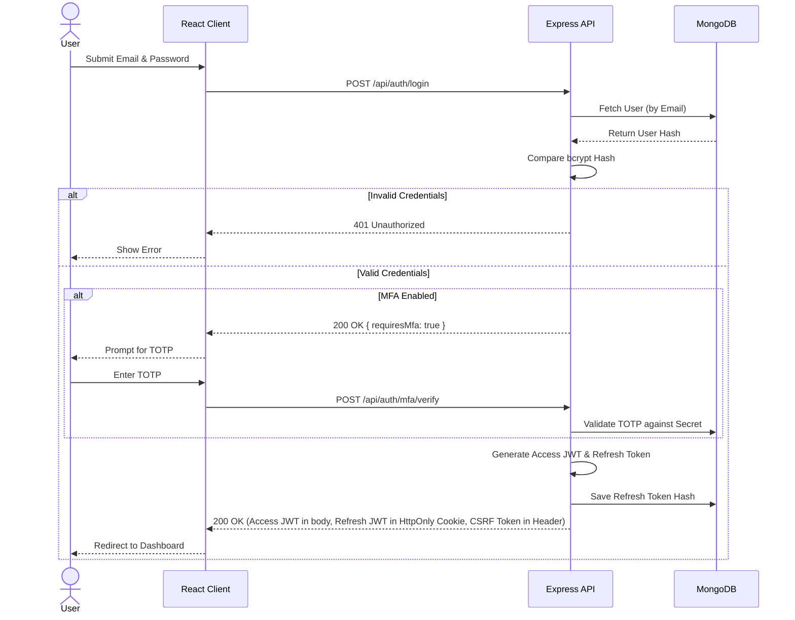
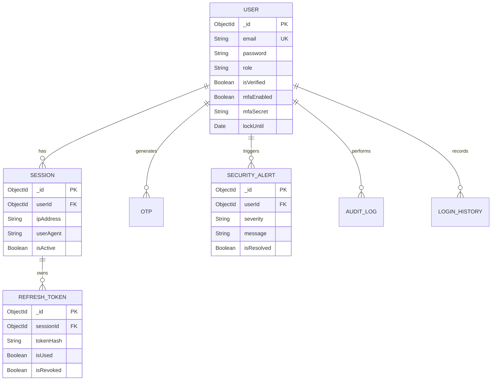
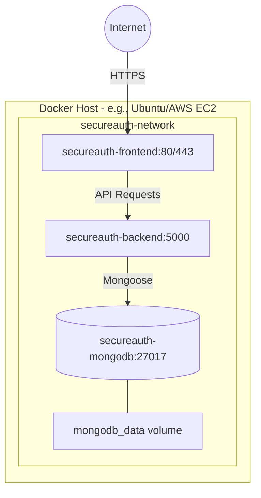
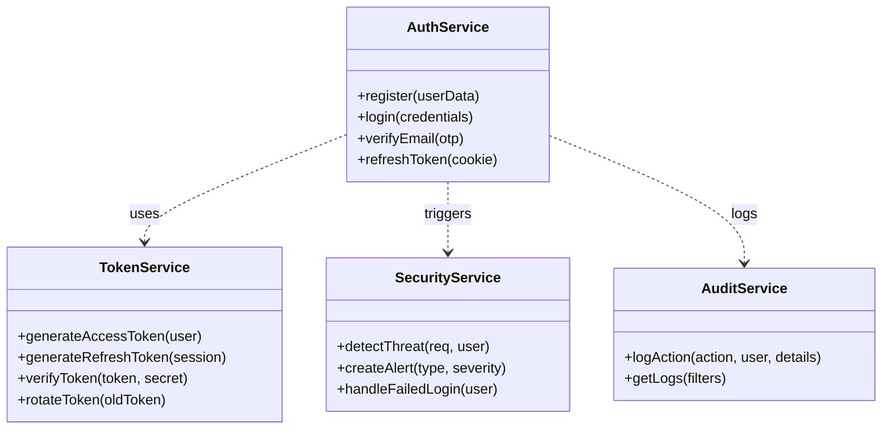

# SecureAuth X — Architecture Diagrams

The following diagrams illustrate the core architectural and structural components of the SecureAuth X platform.

---

## 1. System Architecture Diagram
High-level overview of the MERN stack components, external integrations, and the reverse proxy.



---

## 2. Authentication Flow (Sequence Diagram)
Demonstrates the secure login process with Multi-Factor Authentication and JWT issuance.



---

## 3. Entity-Relationship (ER) Diagram
Overview of the MongoDB collections and their conceptual relationships.



---

## 4. Use Case Diagram
Core interactions available to Users and Admins.

```mermaid
usecaseDiagram
    actor User
    actor Admin
    
    User <|-- Admin
    
    rectangle "SecureAuth X System" {
        usecase "Register & Verify Email" as UC1
        usecase "Login & Authenticate" as UC2
        usecase "Manage MFA" as UC3
        usecase "Update Profile" as UC4
        usecase "View Login History" as UC5
        usecase "Terminate Sessions" as UC6
        
        usecase "View Platform Stats" as UC7
        usecase "Manage Users (Block/Delete)" as UC8
        usecase "Resolve Security Alerts" as UC9
        usecase "View Global Audit Logs" as UC10
    }
    
    User --> UC1
    User --> UC2
    User --> UC3
    User --> UC4
    User --> UC5
    User --> UC6
    
    Admin --> UC7
    Admin --> UC8
    Admin --> UC9
    Admin --> UC10
```

---

## 5. Deployment Diagram
How the Docker containers are orchestrated in production.



---

## 6. Class Diagram (Backend Services)
High-level view of the service layer separation of concerns.


